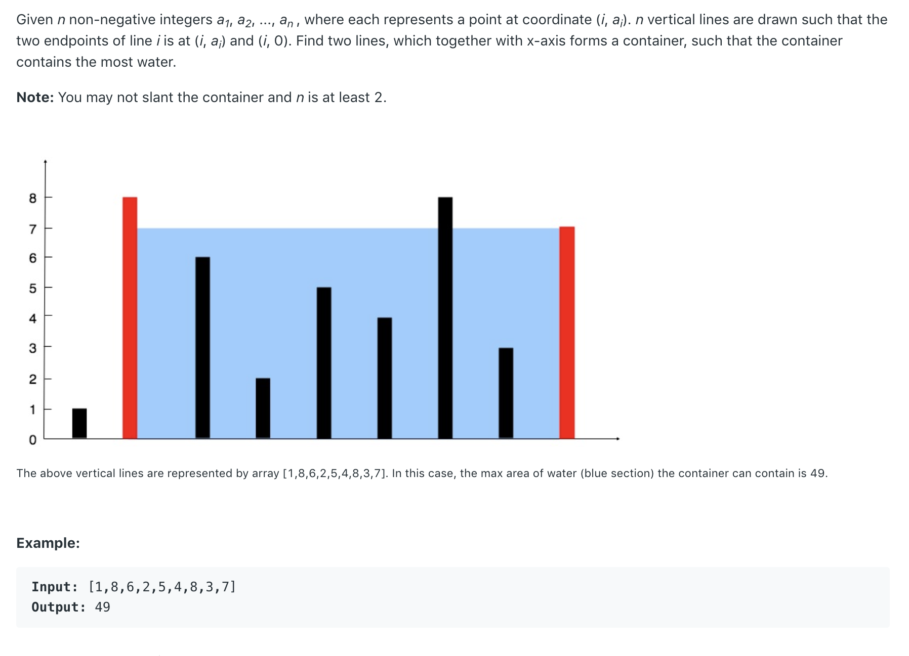

# 11. Container With Most Water



思路： 最大的水量是由较短的那个bar来决定的，我们在每一次做选择的时候都在试图取找到一个可能的更大解。

例子： 在图中的情况下，怎样选择下一步才能使得水量有可能变大， 只有改变右手边的bar，因为它相对较短，最大的水量是由相对较小的那个bar来决定的，在一次只做一个改变的情况下，我们通过改变那个较小的bar可以直接对结果产生改变, 无论改变后 bar是变大了，还是变小了。

而对于左边的bar来说，改变它可能有两种结果，

1. 数值变大，对结果没有影响，因为还是比右边的bar 大
2. 数值变小，如果还是比右边的大，结果没有改变， 小于右边，结果变小了。

所以如果改变左边的bar得到的结果是只有变小或不变，而我们要求的是最大的面积。所以要在每次循环中关注较小的那个bar，通过改变它来不断的得到不同的值。

```java
class Solution {
    public int maxArea(int[] height) {
        if(height==null || height.length <2) return 0;
        int len =  height.length; 
        int res  = 0;
        for(int s =0, e= len-1; s<e;)
        {
            res = Math.max(res,Math.min(height[s],height[e])* (e-s));
            if(height[e]>height[s]) s++;
            else e--;
            
        }
        return res;
    }
}
```

