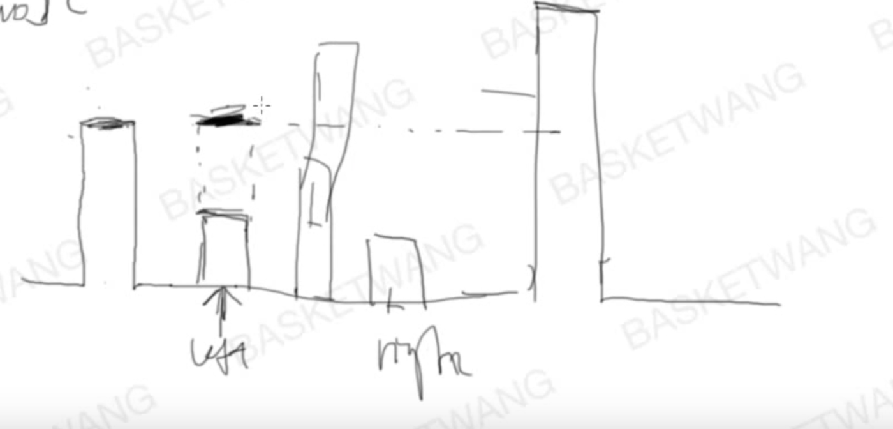
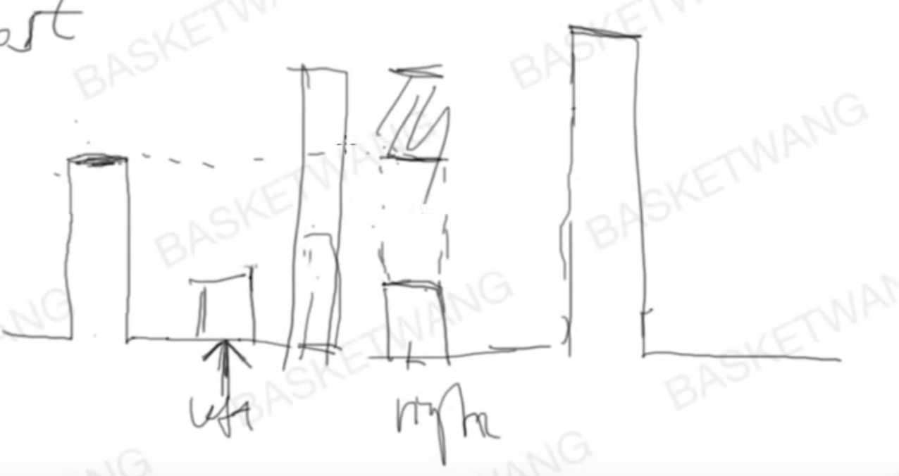

# 42. Trapping Rain Water


two pointer 的解法：这个方法不是通过高度 \* 宽度来得到答案，而是把每一个index对应的水量加起来，得到最后的答案。

分析了例子之后发现，每一个index的水量由 min\(leftmax, rightmax\) 来决定



上图中标注为left的位置，它的水量最大只能到leftmax的高度，而right的水量不能确定，如果在 left和right之间有一个更高的bar则right的水量由这个bar来决定了。



到此思路就清晰了，我们同时保持leftmax和rightmax，对于一个index，取min\(leftmax,rightmax\)减去对应的高度，得到水量，然后移动指针。

```java
public int trap(int[] height)
{
    if(height == null|| height.length<2) return 0;
    int left = 0 , right = height.length-1;
    int leftMax = height[0],rightMax = height[height.length-1];
    int result = 0;
    while(left<=right)
    {
        leftMax = Math.max(leftMax,height[left]);
        rightMax = Math.max(rightMax,height[right]); 
        if(leftMax<=rightMax) result+=leftMax-height[left++];
        else result+=rightMax-height[right--];
    }
    return result;
}
```

这个方法比用stack更快，stack的解法下面链接



