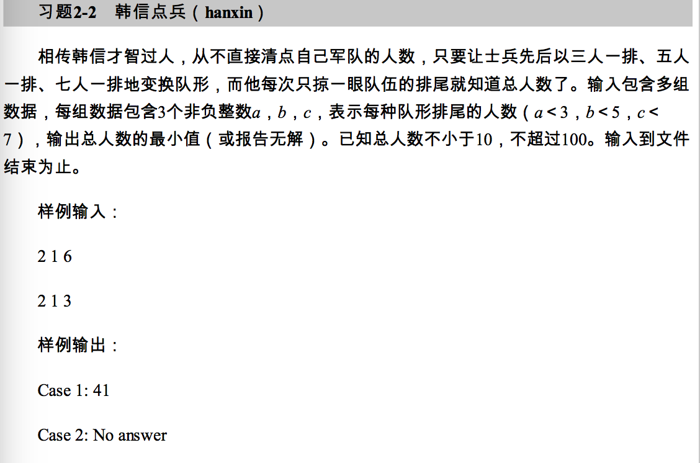

# 第二章 循环

提示 2-3 特别留意**当前行**的**跳转**和**变量**的**改变**

提示 2-4 尽量**缩小变量**的**定义范围**

### 例题 2-1 aabb 输出所有形如aabb的4位完全平方数

```java
public List<Integer> format()
{
    List<Integer> res = new ArrayList<>();
    for(int a = 1;a<10;a++)
    {
        for(int b = 0;b<10;b++)
        {
            //非常巧妙的用 a*1100 + b*11 来得到数字
            int cur = a*1100+ b*11;
            //书上用 Math.floor(cur+ 0.5) 来解决double计算的误差问题
            int floor = (int)Math.floor(Math.sqrt(cur)+0.5); 
            //在java 中有 round 函数可以
            int floor = (int)Math.round(Math.sqrt(cur));
            //记得数据类型转换的问题 double -> int ， int -> double
            if( floor*floor == cur) res.add(cur);
        }
    }
    return res;
}
```

double 计算精度问题 ：如果在计算后 1 变成了 0.99999999, floor的结果是0 而不是 1， 为了减小误差我们改为四舍五入 这样 floor\(x+0.5\)  ==1 x的值范围就从 【1～2）\(floor\(x\) ==1\) 变为【0.5 ~ 1.5\) \(floor\(x+0.5\)  ==1\) 达到了四舍五入的效果

在java 中 提供了 **Math.round** 函数 可以自动为我们**四舍五入**，但是要注意返回的类型是**long**

另外一个思路是枚举法，遍历所有的数字来检测

```java
public List<Integer> format()
{
    List<Integer> list = new ArrayList<>();
    for(int i = 1;;i++)
    {
        int cur = i*i;
        if(cur<1000) continue;
        if(cur>=10000) break;
        if(cur/1000 == (cur/100)%10 && (cur%100)/10 == (cur%10))
            list.add(cur);
    }
    return list;
}
```

提示 for 的三个部分都可以省略

### 例题 2-2 3n+1 的问题 对于任意大于1的自然数 n，如果n为奇数，把n设为 3n+1， 如果是偶数，就设为n的一半，n&lt;=1e9

3-&gt;10-&gt;5-&gt;16-&gt;8-&gt;4-&gt;2-&gt;1

```java
public boolean check(int n)
{  
    long count = 0;
    for(long i = n;i>1;)
    {
        if(i%2 == 0) i>>=1;
        else i= 3*i+1;
        count++;
    }
    return count;
}
```

### 例题 2-3 近似计算 pi／4 = 1 - 1／3 + 1／5  - 1／7 +..... 最后一项小于1e-6

```java
public double cal()
{
    double res = 0;
    for(int i =0;;i++)
    {
        double cur = 1.0/(i*2+1);
        if(cur<1e-6) break;
        if(i%2 == 0) res+=cur;
        else res -=cur;
    }
    return res;
}
```

### 例题 2-4 阶乘之和 输入n，计算 s=1!+2!+3!+.....+n! 的末六位数 n&lt;=1e6 

我的错误解，会溢出

```java
public int cal(int n)
{
    long result = 0;
    long cur = 1;
    for(int i = 1;i<=n;i++)
    {
        cur *=i;
        result+=cur;
    }
    //非常巧妙的用mod来取最后6位的值。
    return (int)result%1000000;
}
```

提示 对于只 包含**加减乘除**的计算可以在每一步之后对于n取余数，最后结果不变。

```java
public int cal(int n)
{
    int result = 0;
    int cur = 1;
    //对于常数可以设为const，这样就不容易出错，方便更改
    static final int MOD = 1000000;
    for(int i = 1;i<=n;i++)
    {
        cur= (cur*i)%MOD;
        result = (result+cur)%MOD;
    }
    return result;
}
```

提示 对于反复使用的常量，可以设为static final 常量，这样便于更改， 增加可读性。

提示 从 40开始 答案都是一样的，因为25！末尾有6个零，所以以后的所有值都不会对答案产生影响。

```java
public int cal(int n)
{
    int result = 0;
    int cur = 1;
    final int MOD = 1000000;
    int len = Math.min(25,n);
    for(int i = 1;i<=len;i++)
    {
        cur = (cur*i)%MOD;
        result = (result+cur)%MOD;
    }
    return result;
}
```

这样得到了一个最好的解。

提示 循环最大的两个问题

1. 算术计算溢出。
2. 效率低以后

重点要解决好这两个问题。

### 例题 2-5 数据统计 ，对于一组数字，求最小值，最大值，和平均值

```java
public double cal(int[] arr)
{
    int min = arr[0];
    int max = arr[1];
    double ave = 0;
    for(int i = 0;i< arr.length;i++)
    {
        min = Math.min(min,arr[i]);
        max = Math.max(max,arr[i]);
        ave = ave*(i/(i+1.0)) + arr[i]/(i+1.0);
    }
    return ave;
}
```

### 习题 2-1 水仙花数 100～999 abc = a \*a\*a + b\*b\*b+ c\*c\*c

```java
public List<Integer> cal()
{
    List<Integer> res = new ArrayList<>();
    for(int i = 100;i<1000;i++)
    {
        int a = i/100;
        int b = (i/10)%10;
        int c = i%10;
        if(a*a*a + b*b*b + c*c*c == i) res.add(i);
    }
    return res;
}
```

### 习题 2-2 韩信点兵 



```java
public 
```

