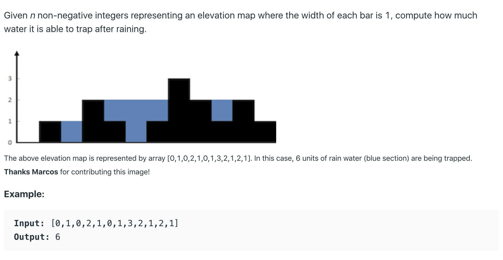

# 42. Trapping Rain Water



单调栈的解法：这道题直观的看来就是用stack来解，建立单调递减的stack，每次加入更大的数就把之前所有小于当前入栈值的stack元素全部出栈，同时计算当前的局部解

提示 对于单调栈，一般存元素在数组中的index

提示 注意检查 stack 是否为空。

复杂度 为O（n）所有的元素都进出栈一次

```java
public int trap(int[] height)
{
    if(height == null || height.length==0) return 0;
    Stack<Integer> stack = new Stack<>();
    int res = 0;
    for(int i = 0;i< height.length;i++)
    {
        while(!stack.isEmpty() && height[stack.peek()] <= height[i])
        {
            int cur = height[stack.pop()];
            if(!stack.isEmpty())
            {
                res +=(Math.min(height[stack.peek()],height[i])-cur)*(i-stack.peek()-1);
            }
        }
        stack.push(i);
    }
    return res;   
}
```

更好的一个解法




